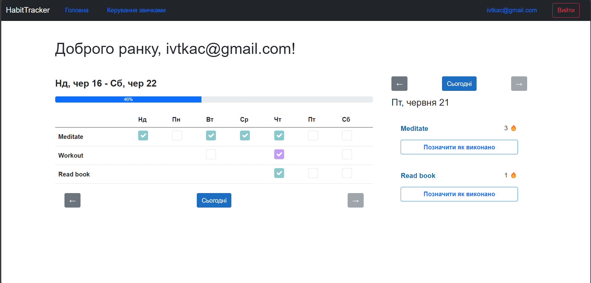
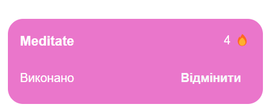
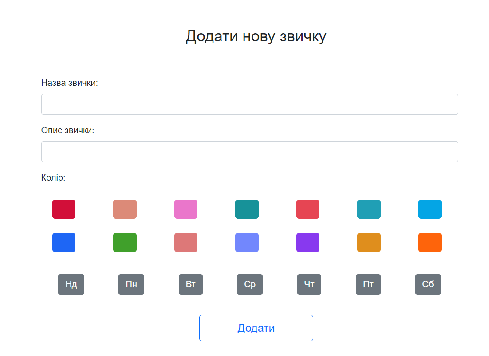
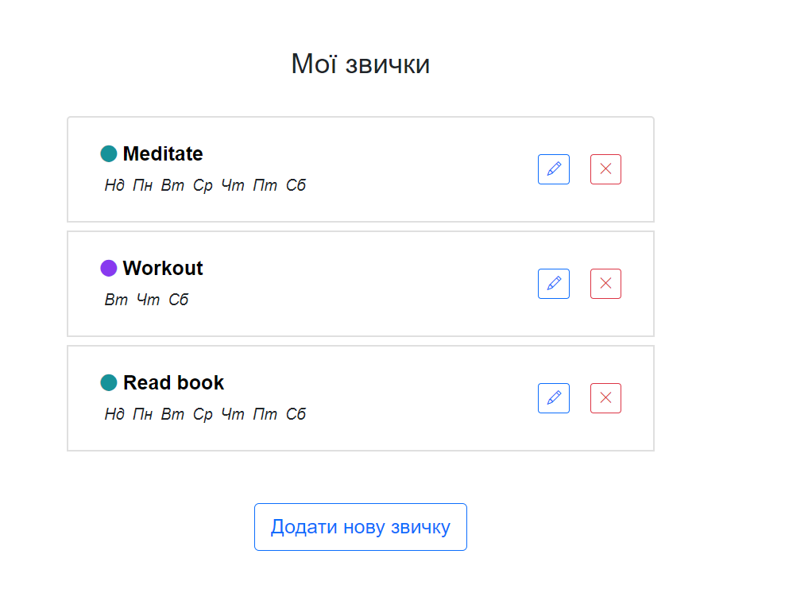

# Habit Tracker

HabitTracker is a web application designed to help users track and manage their daily habits. The main interface provides a clear and concise way to mark habits as completed, track progress over a week, and visualize streaks for each habit.

## Features

### 1. User Authentication

Login/Logout: Users can log in and log out using their email addresses.

### 1. Habit Management

Add/Edit Habits: Users can add new habits or edit existing ones to suit their needs.
Delete Habits: Users can remove habits that are no longer relevant.

### 3. Daily Habit Tracking
Mark as Completed: Users can mark habits as completed for the current day.
Streak Tracking: The application tracks how many consecutive days a habit has been completed.

### 4. Weekly Progress
Weekly Overview: Users can view a weekly overview of their habits, showing which days they have completed each habit.
Progress Bar: A progress bar indicates the percentage of habits completed for the week.

### 5. Navigation
Date Navigation: Users can navigate between different days to view and update their habit completion status.
Current Day Button: A button to quickly return to the current day’s view.

## Screenshots

